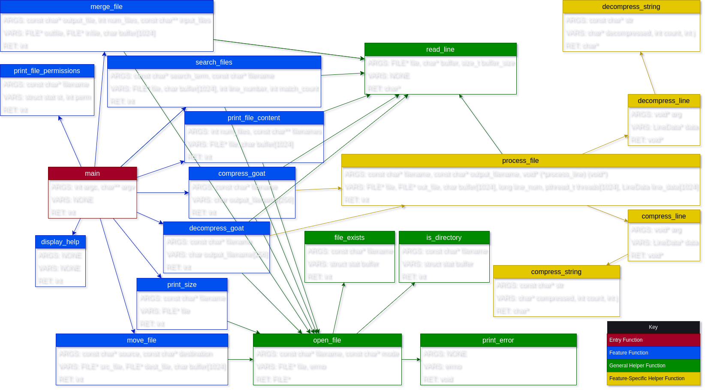

# Goat Tool

Convert `.md` to `.pdf` using [md-to-pdf](https://md-to-pdf.fly.dev/)

## Authors
- Deautaun Ross
- Jaret Smith
- Johan Olvera
- ChatGPT

## Installation (Unix/Linux-Based OSes)
1. Clone the repository: `git clone https://github.com/dross1-dross1/goat-tool.git`
2. Navigate to the directory: `cd goat-tool/`
3. Compile and build: `make` or `./build.sh`
4. Run GoatTool: `./bin/goattool [--flag] (args)`
5. Optional: Run tests with `./tests.sh` (automatic if compiled with `./build.sh`)

## Table of Contents
1. [Introduction](#introduction)
2. [Command Switches](#command-switches)
3. [Usage Examples](#usage-examples)
4. [Functions](#functions)
5. [Function Call Graph](#function-call-graph)
6. [Test Cases](#test-cases)
7. [Code Test Analysis](#code-test-analysis)
8. [Privacy Disclosure](#privacy-disclosure)
9. [Project File Structure](#project-file-structure)

## Introduction
Goat Tool is a command-line utility for Unix environments, designed to assist in file and directory operations. Use the tool in a Unix terminal with `./goattool` followed by the desired switches.

## Command Switches
- `-h`: Display the help menu. Usage: `./goattool -h`
- `-p [FILENAMES...]`: Print file contents. Usage: `./goattool -p example.txt`
- `-s [FILENAME]`: Search for a string in a file. Usage: `./goattool -s "search_term" example.txt`
- `-z [FILENAME]`: Print file size. Usage: `./goattool -z example.txt`
- `-m [OUTPUT_FILE] [INPUT_FILES...]`: Merge files. Usage: `./goattool -m merged.txt file1.txt file2.txt`
- `-c [FILENAME]`: Compress a file. Usage: `./goattool -c example.txt`
- `-d [FILENAME]`: Decompress a .goat file. Usage: `./goattool -d example.goat`
- `-r [FILENAME]`: Print file permissions. Usage: `./goattool -r example.txt`
- `-v [SOURCE] [DESTINATION]`: Move or rename a file. Usage: `./goattool -v source.txt dest.txt`

## Usage Examples
1. **Printing File Content**: `./goattool -p example.txt`
2. **Searching for a String**: `./goattool -s "text" example.txt`
3. **Compressing and Decompressing**:
   - `./goattool -c example.txt`
   - `./goattool -d example.goat`

## Functions
- **`int main(int argc, char** argv)`**: Entry point. Processes command-line arguments.
- **`int display_help()`**: Displays help instructions.
- **`int print_file_content(int num_files, const char** filenames)`**: Prints file contents.
- **`int print_size(const char* filename)`**: Prints file size.
- **`int merge_file(const char* output_file, int num_files, const char** input_files)`**: Merges files.
- **`int move_file(const char* source, const char* destination)`**: Moves/renames files.
- **`int search_files(const char* search_term, const char* filename)`**: Searches within a file.
- **`int compress_goat(const char* filename)`**: Compresses a file.
- **`int decompress_goat(const char* filename)`**: Decompresses a .goat file.
- **`int print_file_permissions(const char* filename)`**: Prints file permissions.

## Function Call Graph


## Test Cases
Includes various scenarios like printing help menu, file content, searching strings, compressing and decompressing files, etc.

## Code Test Analysis
- **Test Coverage**: 100% code coverage with all tests passing.
- **Real-World Predictability**: Tests are thorough but cannot perfectly predict real-world scenarios.

## Privacy Disclosure
GoatTool respects your privacy. It operates locally without transmitting data externally. Please exercise caution with sensitive information.

## Project File Structure

```
GoatTool/
│ ├── LICENSE
│ ├── README.md
│ ├── .gitignore
│ ├── Makefile
│ ├── tests.sh
│ ├── build.sh
│ ├── docs/
│ │ ├── DESIGN_DOCUMENT.md
│ │ └── DESIGN_DOCUMENT.pdf
│ ├── src/
│ │ ├── main.c
│ │ ├── display.c
│ │ ├── file_operations.c
│ │ ├── search.c
│ │ ├── compression.c
│ │ ├── permissions.c
│ │ └── utils.c
│ ├── include/
│ │ ├── display.h
│ │ ├── file_operations.h
│ │ ├── search.h
│ │ ├── compression.h
│ │ ├── permissions.h
│ │ └── utils.h
│ ├── test_files/
│ │ ├── example_file.txt
│ │ ├── file1.txt
│ │ ├── file2.txt
│ │ ├── empty_file.txt
│ │ ├── special@file#.txt
│ │ ├── locked_file.txt
│ │ ├── locked_file.txt.goat
│ │ └── locked_file.txt.goat.decompressed
│ └── assets/
│ ├── function_call_diagram.png
│ └── function_call_diagram.drawio
```

